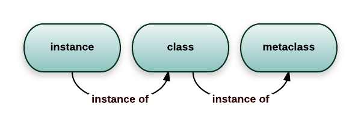

# Python Advance Notes
<br>

## 目錄
* **[進階物件導向程式設計](#進階物件導向程式設計)**
    * [元類型](#元類型-metaclass)
    * [動態語言](#動態語言)


<br><br>
## 進階物件導向程式設計

<br><br>
### 元類型 (metaclass)
<br>

原文在 [stackvoerflow](https://stackoverflow.com/questions/100003/what-are-metaclasses-in-python) 上的解釋

<br>



#### 類型也是物件

類型是用來描述如何產生物件的程式碼

```python
>>> class ObjectCreator(object):
…       pass
…
>>> my_object = ObjectCreator()
>>> print(my_object)
<__main__.ObjectCreator object at 0x7fcbe94f4518>
```

而在 python 中，類型就是物件本身，在使用關鍵字 `class` 時，python 解釋器在執行中會創建一個物件，這個物件擁有創造新的物件的能力。

所以可以對類型的這個物件，做以下操作 :

1. 將它覆值給一個變量
2. 複製它
3. 為它增加屬性
4. 將它做為函數參數傳遞

```python
# you can print a class because it's an object
>>> print(ObjectCreator)
<class '__main__.ObjectCreator'>
>>> def echo(o):
...     print(o)
... 
# you can pass a class as a parameter
>>> echo(ObjectCreator)
<class '__main__.ObjectCreator'>
>>> print(hasattr(ObjectCreator, 'new_attribute'))
False
# you can add attributes to a class
>>> ObjectCreator.new_attribute = 'foo'
>>> print(hasattr(ObjectCreator, 'new_attribute'))
True
>>> print(ObjectCreator.new_attribute)
foo
# you can assign a class to a variable
>>> ObjectCreatorMirror = ObjectCreator
>>> print(ObjectCreator())
<__main__.ObjectCreator object at 0x7fcbe8dfac88>
```

<br>

#### 動態創造類型

類型也是物件，就像其他任何物件一般，可以動態創造它

首先，可以利用 `class` 在函數中創建一個類型

```python
>>> def choose_class(name):
...     if name == 'foo':
...         class Foo(object):
...             pass
...         return Foo # return the class, not an instance
...     else:
...         class Bar(object):
...             pass
...         return Bar
...
>>> MyClass = choose_class('foo')
>>> print(MyClass) # the function returns a class, not an instance
<class '__main__.Foo'>
>>> print(MyClass()) # you can create an object from this class
<__main__.Foo object at 0x89c6d4c>
```

因為仍然需要創建類型本身，顯得不夠動態

可以思考的是類型也是對象，應當是可以通過其它東西來生成

而當使用 `class` 時， python 自動生成類型這個物件，而也要有方法可以手動生成這個物件才是

回想函數 `type` ，這個古老且強大的函數可以了解一個物件的類型是什麼

```python
>>> print(type(1))
<class 'int'>
>>> print(type('1'))
<class 'str'>
>>> print(type(ObjectCreator))
<class 'type'>
>>> print(type(ObjectCreator()))
<class '__main__.ObjectCreator'>
```

其實， `type` 還有一種完全不同的功能，就是動態的創造類型

`type` 可以接收一個類型的描述做為參數，返回一個類型

> 要知道，一個函數根據不同傳入的參數有不同的用法，是一件很蠢的事情，但在 python 中這樣的用義是為了向後的兼容性

```
type(name of the class,
     tuple of the parent class (for inheritance, can be empty),
     dictionary containing attributes names and values
    )
```

用 `class` 生成的類型對應到用 `type` 生成的類型

```python
>>> class MyShinyClass(object):
...       pass
```

```python
>>> MyShinyClass = type('MyShinyClass', (), {}) # returns a class object
>>> print(MyShinyClass)
<class '__main__.MyShinyClass'>
>>> print(MyShinyClass()) # create an instance with the class
<__main__.MyShinyClass object at 0x8997cec>
```

如果需要在類型裡加入類型屬性，可以將用字典形式當作參數傳入 `type`

```python
>>> class Foo(object):
...       bar = True
```

```python
>>> Foo = type('Foo', (), {'bar':True})
>>> print(Foo)
<class '__main__.Foo'>
>>> print(Foo.bar)
True
>>> f = Foo()
>>> print(f)
<__main__.Foo object at 0x8a9b84c>
>>> print(f.bar)
True
```

當然也可以繼承，用元組的形式當作參數傳入 `type`

```python
>>>   class FooChild(Foo):
...         pass
```

```python
>>> FooChild = type('FooChild', (Foo,), {})
>>> print(FooChild)
<class '__main__.FooChild'>
>>> print(FooChild.bar) # bar is inherited from Foo
True
```

最終，如果想要在類型裡增加方法的話，只需要定義函數將它作為屬性覆值即可

增加實例方法，靜態方法，類型方法

```python
>>> def echo_bar(self):
...       print(self.bar)
...
>>> FooChild = type('FooChild', (Foo,), {'echo_bar': echo_bar})
>>> hasattr(Foo, 'echo_bar')
False
>>> hasattr(FooChild, 'echo_bar')
True
>>> my_foo = FooChild()
>>> my_foo.echo_bar()
True
```

並且就像正常的創建類型增加新的方法一樣，在動態創建類型後也可以相同使用

```python
>>> def echo_bar_more(self):
...       print('yet another method')
...
>>> FooChild.echo_bar_more = echo_bar_more
>>> hasattr(FooChild, 'echo_bar_more')
True
```


#### 最終，到底什麼是元類型

元類型是用來創建類型(物件)，元類型被視為類型的類型

```python
MyClass = MetaClass()
my_object = MyClass()
```

```python
MyClass = type('MyClass', (), {})
```

`type` 就是 python 背後用來創建所有類型的元類型，可能會猜想為什麼 `type` 為什麼不是 `Type`，猜測可能是為了和 `str` 和 `int` 保持一致性`str` 和 `int` 分別是創建字串和整數物件的類型，可以通過檢查 `__class__` 來確認這一點

python 中所有的東西，都是物件，這包括整數、字串、函數、類型，而它們都是從 `type` 類型創建出來

```python
>>> age = 35
>>> age.__class__
<type 'int'>
>>> name = 'bob'
>>> name.__class__
<type 'str'>
>>> def foo(): pass
>>> foo.__class__
<type 'function'>
>>> class Bar(object): pass
>>> b = Bar()
>>> b.__class__
<class '__main__.Bar'>
```

```python
>>> age.__class__.__class__
<type 'type'>
>>> name.__class__.__class__
<type 'type'>
>>> foo.__class__.__class__
<type 'type'>
>>> b.__class__.__class__
<type 'type'>
```

可以看到對於任何一個物件取 `__class__` 的 `__class__` 皆為 `type`

`type` 是 python 內建的元類型，當然也可以自己定義元類型

<br>

#### `__metaclass__` 屬性

可以在定義一個類型時為其添加 `__metaclass__` 屬性

```python
class Foo(object):
    __metaclass__ = something...
    [...]
```

這麼做的話 python 會用元類型來創建類型 `Foo`，但這裡有些地方需要注意，首先雖然寫了 `class Foo(object)`，但是類型 `Foo` 並未在記憶體中被創建。 python 會在類型的定義中尋找 `__metaclass__` 屬性，如果找到了就會用它來創建類型 `Foo`，如果沒找到，就會用內建函數 `type` 來創建這個類型

所以當定義以下程式碼

```python
class Foo(Bar):
    pass
```

python 會做如下的操作

1. 判斷 `Foo` 中有沒有 `__metaclass__` 這個屬性，如果有， python 會通過其在記憶體中創建一個類型物件
2. 如果 python 沒有找到 `__metaclass__` ，它會繼續在模組中尋找 `__metaclass__`  屬性，並嘗試做和前述相同的操作
3. 如果 python 在都找不到 `__metaclass__` ，它就會使用父類型 `Bar` 所擁有的元類型，也就是 `type` 

要小心的一點是， `__metaclass__` 屬性是無法被繼承的

現在的問題是，可以在 `__metaclass__` 中放些什麼，而答案是可以創建類型的東西。

而可以創建類型的都西，即是元類型 `type` 和它的子類型

<br>

#### 自定義元類型

元類型的主要目的是為了當創建類型時，可以自動的改變它。通常我們會為 API 做這件事情，希望能創建符合當前環境的類型

假想一個很蠢的例子，決定在模組裡所有類型的屬性都應該是大寫形式，其中一種實現的方式就是在模組級別設定 `__metaclass__` 。通過這種方式，模組中的所有類型會經由元類型來創建，只需要告訴元類型把所有的屬性都改成大寫形式即可

幸運地， `__metaclass__` 可以在任何地方被呼叫，它可以不必是類型的形式

```python
# the metaclass will automatically get passed the same argument
# that you usually pass to `type`
def upper_attr(future_class_name, future_class_parents, future_class_attr):
    """
      Return a class object, with the list of its attribute turned
      into uppercase.
    """

    # pick up any attribute that doesn't start with '__' and uppercase it
    uppercase_attr = {}
    for name, val in future_class_attr.items():
        if not name.startswith('__'):
            uppercase_attr[name.upper()] = val
        else:
            uppercase_attr[name] = val

    # let `type` do the class creation
    return type(future_class_name, future_class_parents, uppercase_attr)

# __metaclass__ = upper_attr # this won't work in python3

class Foo(object, metaclass=upper_attr): # 
    # but we can define __metaclass__ here instead to affect only this class
    # and this will work with "object" children
    bar = 'bip'

print(hasattr(Foo, 'bar'))
# Out: False
print(hasattr(Foo, 'BAR'))
# Out: True

f = Foo()
print(f.BAR)
# Out: 'bip'
```

用真正的類型當做元類型

```python
# remember that `type` is actually a class like `str` and `int`
# so you can inherit from it
class UpperAttrMetaclass(type):
    # __new__ is the method called before __init__
    # it's the method that creates the object and returns it
    # while __init__ just initializes the object passed as parameter
    # you rarely use __new__, except when you want to control how the object
    # is created.
    # here the created object is the class, and we want to customize it
    # so we override __new__
    # you can do some stuff in __init__ too if you wish
    # some advanced use involves overriding __call__ as well, but we won't
    # see this
    def __new__(cls, future_class_name,
                future_class_parents, future_class_attr):

        uppercase_attr = {}
        for name, val in future_class_attr.items():
            if not name.startswith('__'):
                uppercase_attr[name.upper()] = val
            else:
                uppercase_attr[name] = val

        # method 1 : but this is not really OOP, We call type directly and we don't override or call the parent __new__.
        # return type(future_class_name, future_class_parents, uppercase_attr)
        
        # method 2 : reuse the type.__new__ method. this is basic OOP, nothing magic in there
        # return type.__new__(cls, future_class_name, future_class_parents, uppercase_attr)
        
        # method 3 : make it even clearner by user super, which will ease inheritance
        return super(UpperAttrMetaClass, cls).__new__(cls, future_class_name, future_class_parents, uppercase_attr)
```

關於元類型已經沒有別的可以說了。使用到元類型的程式碼較複雜，這背後的原因並不是因為元類型本身，而是因為你通常會使用元類型去做一些晦澀的事情

確實，元類型特別有用在做一些黑暗魔法的事情，也應此會產生出較複雜的東西。

但就元類型本身而言，其實很簡單

1. 攔截類型的創建
2. 修改類型
3. 返回修改後的類型

<br>

#### 為什麼要用元類型而不是函數


<br>

#### 究竟為什麼要使用元類型

一般來說，根本就用不到它

> 元類型就像是深度的魔法， 99% 的使用者根本不必為這擔心。如果想要弄清楚究竟是否需要用到元類型，那就代表你不需要它。那些實際用到元類型的人，都非常清楚地知道他們需要做什麼，而根本不需要解釋為什麼
>
>  —— Python界的领袖 Tim Peters

元類型的主要用途是創建 API ，一個典型的例子是 Django ORM

它允許這樣的定義

```python
class Person(models.Model):
    name = models.CharField(max_length=30)
    age = models.IntegerField()
```

但是如果你這樣做

```
guy = Person(name='bob', age='35')
print(guy.age)
```

這並不會返回 `IntegerField` 物件，而是會返回 `int` ，甚至可以直接從資料庫中取出數據

因為 `models.Model` 定義了 `__metaclass__` ，並且使用了一些魔法能夠將 `Person` 轉換成對資料庫的 `complex hook`。 Django 框架將這些看起來很複雜的東西簡單化，藉由著曝光一個簡單的 API 和元類型的使用，並從這個 API 重建程式碼，完成背後真正的工作

<br>

#### 結語

首先，知道了類型其實是能夠創建出類型實例的物件。事實上，類型本身也是元類型的實例

```python
>>>class Foo(object): pass
>>> id(Foo)
142630324
```

python 中的一切都是物件，類型的實例，元類型的實例。除了 `type` 實際上是自己的元類型，這在純 python 上是無法被重現的。

元類型是很複雜的，對於非常簡單的類型，可能不希望通過使用元類型來修改，而可以通過其他兩種技術來實現

1. [Monkey patching](https://en.wikipedia.org/wiki/Monkey_patch)
2. class decorators

當需要動態修改類型時， 99% 的時間最好運用這兩種技術，但其實在 99% 的時間裡，根本就不需要動態改型類型

<br><br>

### 動態語言

<br>


