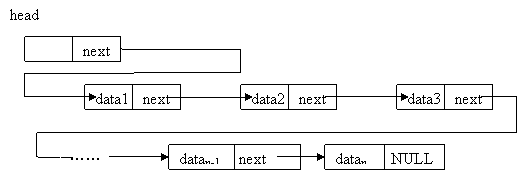
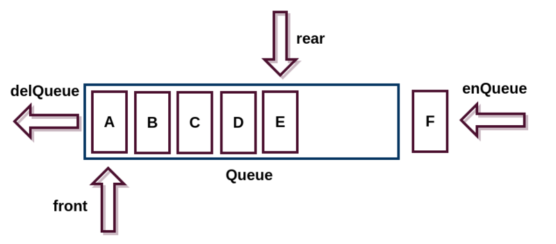
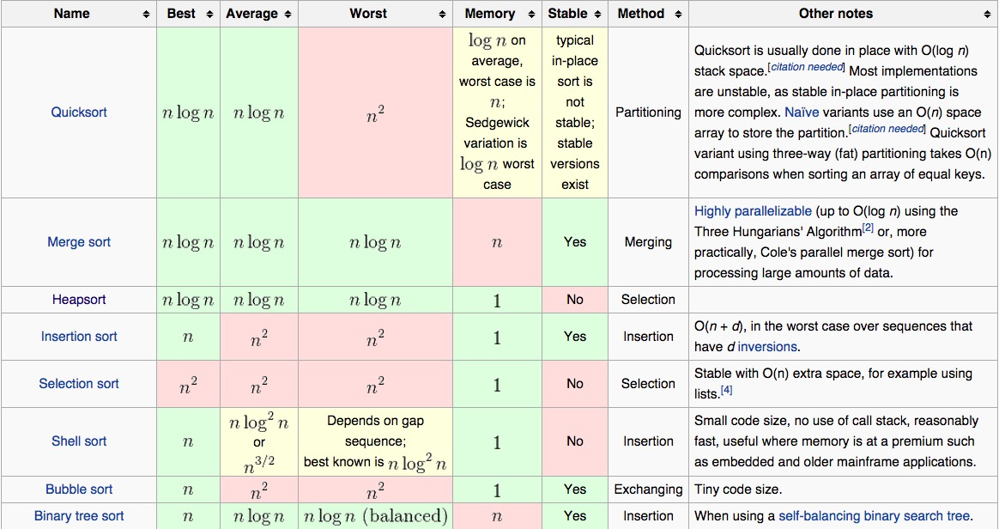

# Python Data Structure and Algorithm Notes
<br>

## 目錄
* **[資料結構與演算法的概念](#資料結構與演算法概念)**
    * [演算法概念](#演算法概念)
    * [演算法效率衡量](#演算法效率的衡量)
    * [Python 模組性能分析](#python-模組性能分析)
    * [資料結構概念](#資料結構概念)
    * [演算法與資料結構的區別](#演算法與資料結構的區別)
    * [抽象資料型態](#抽象資料型態-abstract-data-type)
* **[順序表](#順序表)**
    * 
* **[鏈結表](#鏈結表-linked-list)**
    * [鏈捷表定義](#鏈結表定義)
    * [單向鏈結表](#單向鏈結表)
    * [單向循環鏈結表](#單向循環鏈結表)
    * [雙向鏈結表]()
* **[堆疊](#堆疊-stack)**
    * [堆疊定義](#堆疊定義)
    * [堆疊的實現](#堆疊的實現)
* **[隊列](#隊列-queue)**
    * [隊列定義](#堆疊定義)
    * [隊列的實現](#隊列的實現)
    * [雙端隊列](#雙端隊列-deque)
* **[排序與搜尋](#排序與搜尋)**
    * [排序概念](#排序概念)


<br><br>
## 資料結構與演算法概念

<br><br>

### 演算法概念

<br>

演算法是計算機處理訊息的本質，因為計算機程序本質上是演算法來告訴確切步驟來執行指定的任務。一般地，當演算法在處理訊息時，會從輸入設備或資料的儲存地址讀取數據，把結果寫入輸出設備或某個存儲地址。

演算法是獨立存在的一種解決問題的方法和思想，可以用不同的語言來實現。

演算法的特性

* 輸入 : 演算法具有零個或多個輸入
* 輸出 : 演算法至少有一個或多個輸出
* 有限性 : 演算法必須在有限的步驟內完成，並且每個步驟在可接受的時間內完成
* 有效性 : 演算法中的每個命令都必須為可執行的步驟
* 正確性 : 演算法所產生的結果必須是符合預期的
* 明確性 : 演算法中的每個步驟必須有確定的含意，不會出現模糊與不清楚的情況

<br><br>

### 演算法效率的衡量

<br>

#### 執行時間

對於同一個問題，在相同的環境下，演算法優劣的差距可以用執行時間的長短來做判斷。

<br>

#### 時間複雜度

要評斷一個演算法的優劣，最基本的指標就是時間和空間。而最直覺的方式，就是測量程式的執行時間和記憶體使用。但是由於相同演算法在不同裝置執行時間有差異，又由於每個人實現演算法所採用的程式語言與程式技巧不相同，所以這使得執行時間和記憶體用量不是一個穩定的評斷標準

數學家於是把將執行步驟的數量當成評斷標準，進而寫成代數方程式。而有了步驟數量還可以透過計算機的中央處理器時脈粗估執行時間

而近一步地，數學家用代數的方式來表示時間複雜度的數量級 `O(N)`

<br>

#### 最壞時間複雜度

分析演算法存在幾種可能的情況

* 演算法完成最少需要多少步驟，即**最優時間複雜度**
* 演算法完成最多需要多少步驟，即**最壞時間複雜度**
* 演算法完成平均需要多少步驟，即**平均時間複雜度**

對於最壞時間複雜度，提供了一種保證，表示此演算法在此種程度的步驟一定能完成

<br>

#### 時間複雜度的計算規則

* 輸入與執行步驟無關係，即只有常數項，時間複雜度為 `O(1)`
* 順序結構，時間複雜度按**加法**計算
* 循環結構，時間複雜度按**乘法**計算
* 分支結構，時間複雜度**取最大值**計算
* 判斷一個演算法的效率，往往只需要關注最高次項

<br><br>

### Python 模組性能分析

<br>

#### timeit

[練習 : 運用 timeit 模組分析函數性能](../timit_module/timeit_test.py)

<br>

#### cProfile


<br><br>

### 資料結構概念

<br>

為了解決問題，需要將資料保存，根據資料的儲存方式的不同會導致需要用不同的演算法進行處理。而希望演算法的效率越高越好，需要考慮資料究竟要如何保存的問題，就是資料結構

資料是一個抽象的概念，將其分類後會得到程式設計語言中的基本類型，如整數、浮點數、字元。而資料的元素之間存在特定的關係，這層關係稱為結構。資料結構就是資料的元素間的關係。

python 中提供了許多現成的資料結構類型，這些系統自定義的固有資料結構，如列表、元组、字典。而有些資料組織方式是 python 中沒有直接定義，需要自己實現這些擴展的資料結構，如堆疊、隊列

<br><br>

### 演算法與資料結構的區別

<br>

資料結構是靜態的描述資料元素之間的關係，演算法則是為了解決實際問題的設計

```
程式 = 資料結構 + 演算法
```

<br><br>

### 抽象資料型態 (Abstract Data Type)

<br>


常用的資料運算方法

* 插入
* 刪除
* 修改
* 搜尋
* 排序


<br><br>

## 順序表

<br><br>

## 鏈結表 (linked list)

<br><br>

### 鏈結表定義

<br>

順序表的構建需要預先知道資料大小來申請連續的存儲空間，在進行擴充時需要進行資料的搬遷，使用起來並不是很靈活，而鏈結表結構可以充分的利用記憶體空間，實現動態管理

鍊結表是一種常見的基礎資料結構，為線性表，但不像順序表需要連續的空間來存儲資料，而是在每個節點裡存放下一個節點的位置訊息

<br><br>

### 單向鏈結表

<br>



單向鏈結表每個節點包含兩個元素，訊息元素和鏈結元素。這個鏈結指向鏈結表中的下一個節點，而最後一個節點則指向 `NULL`

<br>

#### 單向鏈結表的操作

| 方法        | 意義  |
| :---:      | :---  |
| is_empty() | 判斷鏈結表是否為空
| length()   | 鏈結表長度
| traverse() | 遍歷整個鏈結表
| add(item)  | 在鏈結表頭部添加元素
| append(item) | 在鏈結表尾部添加元素
| insert(pos, item)| 在指定位置添加元素
| remove(item) | 刪除節點
| search(item) | 查找節點是否存在

[練習 : 單向鏈結表的操作](../linked_list/single_link_list.py)

<br>

#### 鏈結表與順序表的對比

鏈結表失去了順序表隨機讀取的優點，同時鏈結表由於增加了鏈結元素，空間使用較多，但對存儲空間的使用相對較靈活

鏈結表與順序表的複雜度比較

| 操作          | 鏈結表 | 順序表 |
| :---          | :---: | :---: |
| 訪問元素       |  O(n) |  O(1) 
| 在頭部插入/刪除 |  O(1) |  O(n)
| 在尾部插入/刪除 |  O(n) |  O(1)
| 在中間插入/刪除 |  O(n) |  O(n)

<br><br>

### 單向循環鏈結表

<br>

單向循環鏈結表中最後一個節點的鏈結元素不再為 `None` ，而是指向頭節點。

<br>

#### 單向循環鏈結表的操作

[練習 : 單向循環鏈結表的操作](../linked_list/single_cycle_link_list.py)


<br><br>

### 雙向鏈結表

<br>

每個節點有兩個鏈結元素，一個指向前一個節點，當此節點為第一個節點時，指向 `None`，而另一個只向下一個節點，當此節點為最後一個節點時，指向 `None`

<br>

#### 雙向鏈結表的操作

[練習 : 雙向鏈結表的操作](../linked_list/double_link_list.py)


<br><br>

## 堆疊 (stack)

<br><br>

### 堆疊定義

<br>

堆疊為存放資料的容器，特點在於只能允許在容器的頂端進行資料的加入和輸出，而操作的對象都為最後放入的元素，符合後進先出 (LIFO, Last In Fist Out) 的原理


<br><br>

### 堆疊的實現

<br>

堆疊可以用順序表也可以用鏈結表實現

<br>

#### 堆疊的操作

| 方法        | 意義  |
| :---:      | :---  |
| push(item) | 添加一個新元素
| pop()   | 取出一堆疊頂端的元素
| peek() | 返回堆疊頂端的元素
| is_empty()  | 判斷堆疊是否為空
| size() | 堆疊的元素個數

[練習 : 用列表實現堆疊的結構](../stack/stack_sample.py)


<br><br>

## 隊列 (queue)

<br><br>

### 隊列定義

<br>

隊列是一種先進先出 (FIFO, First In Fist Out) 的線性表，不允許在中間位置進行操作。




<br><br>

### 隊列的實現

<br>

與堆疊相同，隊列也可以用順序表或者是鏈結表實現

<br>

#### 隊列的操作

| 方法        | 意義  |
| :---:      | :---  |
| enqueue(item) | 往隊列添加一個新元素
| dequeue()   | 取出一隊列頭部的元素
| is_empty()  | 判斷隊列是否為空
| size() | 隊列的元素個數

[練習 : 利用列表實現隊列](../queue/queue_sample.py)

<br><br>

### 雙端隊列 (deque)

<br>

雙端隊列中的元素可以從兩端插入與刪除

<br>

#### 雙端隊列的操作

| 方法        | 意義  |
| :---:      | :---  |
| add_front(item) | 往雙端隊列頂端添加新元素
| add_rear()   | 往雙端隊列尾端添加新的元素
| remove_front(item) | 刪除雙端隊列頂端元素
| remove_rear()   | 刪除雙端隊列尾端元素
| is_empty()  | 判斷雙端隊列是否為空
| size() | 雙端隊列的元素個數

[練習 : 利用列表實現雙端隊列](../queue/double_end_queue.py)

<br><br>

## 排序與搜尋

<br><br>

### 排序概念

<br>

排序演算法 (sorting algorithm) 是一種能將一串數列依照特定順序進行排列的演算法

#### 排序演算法的穩定性

穩定排序演算法，當兩個鍵值對相等的元素在排序過程中不會改變它們的順序

假設以下數列將以第一個數字做排序

```
(4, 1) (3, 1) (3, 7)（5, 6）
```

產生出來的結果會有兩種可能

```
(3, 1) (3, 7) (4, 1) (5, 6)  （维持順序）
(3, 7) (3, 1) (4, 1) (5, 6)  （順序被改变）
```

不穩定的演算法就有可能造成在排列中，順序被改變的情況

<br><br>

### 冒泡排序 (bubble sort)

<br>

冒泡排序重複的遍歷要排序的數列，一次比較兩個元素，如果順序錯誤就交換，直到沒有再需要交換的元素。這個算法的名自由來是因為較小的元素會經由交換慢慢服到數列的頂端

<br>

#### 演算法運作過程

1. 比較相鄰元素，如第一個比第二個大，交換
2. 對每一對相鄰元素進行相同操作，從開始的第一對到結尾的最後一對。最後的元素將會是最大的值
3. 針對所有元素重複以上的步驟，除了最後一個
4. 持續重複上述步驟直到沒有任何一對相鄰元素需要交換

[練習 : 冒泡排序](../sort_search/bubble_sort.py)

<br>

#### 時間複雜度

* 最優時間複雜度 : O(n)
* 最壞時間複雜度 : O(n^2)
* 穩定性 : 穩定

<br><br>

### 選擇排序 (selection sort)

選擇排序首先在未排序序列中找到最小元素，存放在排序序列的起始位置，接著再從剩餘未排序元素中繼續尋找最小元素，依此類推，直到所有元素排序完畢。

<br>

#### 演算法運作過程

[練習 : 選擇排序](../sort_search/selection_sort.py)

<br>

#### 時間複雜度

* 最優時間複雜度 : O(n^2)
* 最壞時間複雜度 : O(n^2)
* 穩定性 : 不穩定 (考慮升序排列每次選擇最大的情況)

<br><br>

### 插入排序 (insertion sort)

<br>

插入排序的工作原理通過構建有序序列，對於位排序數據，在已排序序列中從後向前掃描，找到相應位置並插入

<br>

#### 演算法運作過程

[練習 : 插入排序](../sort_search/insertion_sort.py)

<br>

#### 時間複雜度

* 最優時間複雜度 : O(n) (升序排列，序列已經處於生序狀態)
* 最壞時間複雜度 : O(n^2)
* 穩定性 : 穩定

<br><br>

### 快速排序 (quick sort)

<br>

快速排序，又稱劃分交換排序 (partition-exchange sort) ，通過將欲排序數列分割成獨立的兩個部份，其中一個部份的所有數據比另外一個部份都要小，然後再按此方法分別對兩部份數據再做劃分

<br>

#### 演算法運作過程

* 從數列中挑出一個元素，稱為基準 (pivot)
* 重新排序數列，所有元素比基準值小的擺放在基準前，比基準值大的擺放在基準後，該基準就會處於數列中間位置
* 遞迴的把子數列排序依照上述方式排序

[練習 : 快速排序](../sort_search/quick_sort.py)

<br>

#### 時間複雜度
* 最優時間複雜度 : O(nlogn)
* 最壞時間複雜度 : O(n^2)
* 穩定性 : 不穩定

<br><br>

### 希爾排序 (shell sort)

<br>

希爾排序是插入拍序的一種，為插入排序的改良版本，由 DL. Shell 於 1959 年提出而得名。

<br>

#### 演算法運作過程

1. 由大到小選定數個間距，最後一個間距必為 1
2. 將資料依指定間距分組，進行插入排序
3. 利用前一次排序的結果來加快排序

常見的間距

* Shell Gap
    * N/2、N/4、...1
* Hibbard Gap
    * 1、3、7、...、2^(k-1)
* Knuth Gap
    * 1、4、13、...、(3^k - 1) / 2
* Sedgewick Gap
    * 1、5、19、41、109、...

[練習 : 希爾排序](../sort_search/shell_sort.py)

<br>

#### 時間複雜度
* 最優時間複雜度 : 根據間距不同而不同
* 最壞時間複雜度 : O(n^2)
* 穩定性 : 不穩定

<br><br>

### 合併排序 (merge sort)

<br>

合併排序是採用分治法 (divide and conquer) 的一個典型應用，思想為先遞迴分解數列，在合併數列

<br>

#### 演算法運作的過程

[練習 : 合併排序](../sort_search/merge_sort.py)

<br>

#### 時間複雜度
* 最優時間複雜度 : O(nlogn)
* 最壞時間複雜度 : O(nlogn)
* 穩定性 : 穩定

<br><br>

### 常見排序演算法比較

<br>



<br><br>

### 搜尋

<br>

搜尋是在一個項目集合中找到一個特定項目的演算法過程，常見的方法有順序搜尋、二分法搜尋、二元樹搜尋、雜湊搜尋

<br>

#### 二分法搜尋 (binary search)

優點是查找速度快，平均性能好，但待查表需為已排列的表，

[練習 : 二分法搜尋](../sort_search/binary_search.py)

<br><br>
## 樹與樹演算法

<br><br>

### 樹的概念

<br>

[WIKI 樹(資料結構)](https://zh.wikipedia.org/wiki/%E6%A0%91_(%E6%95%B0%E6%8D%AE%E7%BB%93%E6%9E%84))

樹是由 n 個有限節點組成的具有層次關係的集合
* 每個節點有零個或多個子節點
* 沒有父節點的節點稱為根節點
* 每一個非根節點的節點只有一個父節點
* 除了根節點外，每個子節點可以分為多個不相交的子樹

<br><br>

### 樹的術語 (terminology)

<br>

* 節點度 (node degree)
    * 一個節點含有的子樹的個數稱為該節點的度
* 樹的度 (degree of tree)
    * 一棵樹中，最大的節點度稱為樹的度
* 葉節點 (Leaf) 或終端節點 (terminal node)
    * 度為零的節點
* 非終端節點 (non-terminal node) 或分支節點 (branch node)
    * 度不為零的節點
* 父節點 (parent)
    * 若一個節點含有子節點，則這個節點稱為其父節點
* 子節點 (child)
    * 一個節點含有的子樹的根節點稱為該節點的子節點
* 兄弟節點 (siblings)
    * 具有相同父節點的節點互稱為兄弟節點
* 節點的層次 (level)
    * 從根開始定義起，根為第1層，根的子節點為第2層，以此類推
* 堂兄弟節點
    * 父節點在同一層的節點互為堂兄弟
* 節點的祖先 (ancestor)
    * 從根到該節點所經分支上的所有節點
* 子孫 (descendant)
    * 以某節點為根的子樹中任一節點都稱為該節點的子孫
* 森林 (forest)
    * 由 m（m >= 0）棵互不相交的樹的集合稱為森林

<br><br>

### 樹的種類

<br>

#### 無序樹

樹中任意節點的子節點之間沒有順序關係，這種樹稱為無序樹，也稱為自由樹

<br>

#### 有序樹

樹中任意節點的子節點之間有順序關係，這種樹稱為有序樹

* 二元樹
    * 每個節點最多含有兩個子樹的樹稱為二元樹
        * 完全二元樹
            * 對於一顆二元樹，假設其深度為 d（d > 1）。除了第 d 層外，其它各層的節點數目均已達最大值，且第 d 層所有節點從左向右連續地緊密排列
        * 滿二元樹
            * 所有葉節點都在最底層的完全二元樹
        * 平衡二元樹 (AVL Tree)
            * 任何節點的兩棵子樹的高度差不大於 1 的二元樹
        * 排序g一種對讀寫操作進行優化的自平衡的二元搜尋樹，能夠保持數據有序，擁有多於兩個子樹二元樹 (二元搜尋樹 (binary search tree))
* 霍夫曼樹
    * 帶權路徑最短的二元樹稱為哈夫曼樹或最優二元樹
* B 樹
    * 一種對讀寫操作進行優化的自平衡的二元搜尋樹，能夠保持數據有序，擁有多於兩個子樹

<br><br>

### 樹的存儲與表示
<br>

<br><br>

### 常見的樹的應用

<br>

1. xml, html 等
2. 路由協議
3. MySQL 資料庫索引
4. 文件系統的目錄結構

<br><br>

### 二元樹

<br>

二元樹 (binary tree) 是每個節點最多只有兩個分支 (即不存在分支度大於 2 的節點) 的樹結構。通常分支被稱作「左子樹」或「右子樹」。二元樹的分支具有左右次序，不能隨意顛倒

<br>

##### 二元樹的性質

1. 在二元樹的第 i 層上至多有 2^(i-1) 個節點
2. 深度為 k 的二元樹至多有 2^k-1 個節點
3. 對任意一棵二元樹，如果其葉節點數為 N0 ，而分支度數為 2 的節點總數為 N2 ，則 N0=N2+1
4. 具有 n 個節點的完全二元樹的深度必為 log2(n+1)
5. 對完全二元樹，從上制下左至右編號，則編號為 i 的的節點其左子節點編號必為 2*i ，其右子節點編號必為 2*i + 1 ，其父編號必為 i/2

<br>

#### 二元樹的創建


<br>


#### 二元樹的廣度遍歷

#### 二元樹的深度遍歷

先序遍歷

中序遍歷

後序遍歷


[練習 : 二元樹的創建與遍歷](../tree/binary_tree.py)
